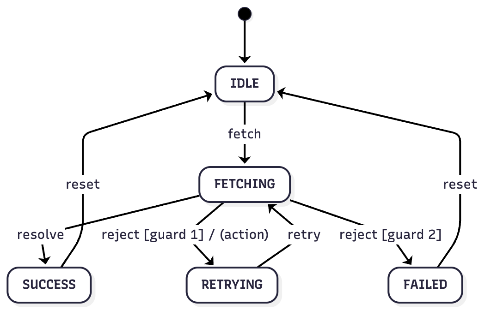

# @marianmeres/fsm

A lightweight, typed, framework agnostic and synchronous finite state machine that acts as a pure state graph description.

It manages state transitions and enforces rules via **guards** and **lifecycle hooks** (`onEnter`/`onExit`), but contains no business logic by design.

To integrate into your application, wrap this FSM in a layer that handles your business logic and calls `fsm.transition(name, payload)` in response to events.

This separation ensures the state machine remains simple, testable, and reusable across different contexts.

## Install
```sh
deno add jsr:@marianmeres/fsm
```
```sh
npm install @marianmeres/fsm
```

## Example

```typescript
import { FSM } from "@marianmeres/fsm";
```

```typescript
type STATES = "IDLE" | "FETCHING" | "RETRYING" | "SUCCESS" | "FAILED";
type TRANSITIONS = "fetch" | "resolve" | "reject" | "retry" | "reset";
type CONTEXT = { attempts: number; maxRetries: number; data: any; error: any; };

const fsm = new FSM<STATES, TRANSITIONS, CONTEXT>({
    initial: "IDLE",
    context: { attempts: 0, maxRetries: 2, data: null, error: null },
    states: {
        IDLE: {
            on: { fetch: "FETCHING" }, // simple string notation
        },
        FETCHING: {
            onEnter: (context: any) => {
                context.attempts += 1;
            },
            on: {
                resolve: "SUCCESS",
                // will resolve to first guard passing state
                reject: [
                    {
                        target: "RETRYING",
                        guard: (ctx) => ctx.attempts < ctx.maxRetries,
                    },
                    {
                        target: "FAILED",
                        guard: (ctx) => ctx.attempts >= ctx.maxRetries,
                    },
                ],
            },
        },
        RETRYING: {
            on: { retry: "FETCHING" },
        },
        SUCCESS: {
            onEnter: (context, data) => {
                context.data = data;
            },
            on: { reset: "IDLE" },
        },
        FAILED: {
            onEnter: (context, error) => {
                context.error = error;
            },
            on: { reset: "IDLE" },
        },
    },
}); 

// examples:

// subscribe to reactive updates
const unsub = fsm.subscribe(({ state, context }) => log.push({ state, context }));

assertEquals(fsm.is("IDLE"), true);

// `transition` is the main API function
assertEquals(fsm.transition("fetch"), "FETCHING");

// this must throw - cannot "retry" from "FETCHING"
assertThrows(() => fsm.transition("retry"));

// non-reactive props
console.log(fsm.state, fsm.context);

// built in mermaid helper you can easily visualize the graph 
// (eg in https://www.mermaidchart.com/ )
console.log(fsm.toMermaid());
/**
stateDiagram-v2
    [*] --> IDLE
    IDLE --> FETCHING: fetch
    FETCHING --> SUCCESS: resolve
    FETCHING --> RETRYING: reject [guard 1]
    FETCHING --> FAILED: reject [guard 2]
    RETRYING --> FETCHING: retry
    SUCCESS --> IDLE: reset
    FAILED --> IDLE: reset
*/
```

